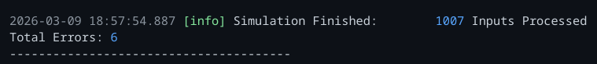
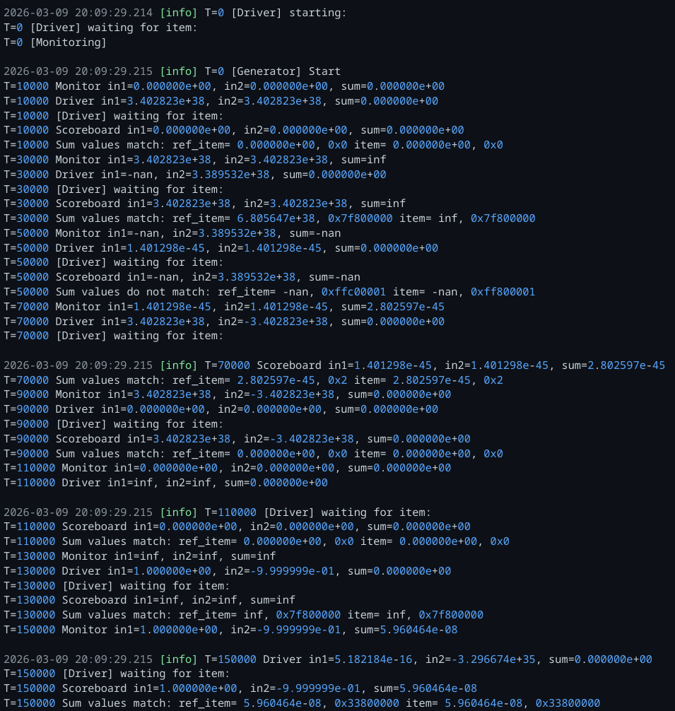

# 32 Bit FLoating Point Adder
### Author: Evan Gilbert
### Github: e-tachyon

## Description:
32 bit(parameterizable) adder targetig IEEE 754 standerds. It is purely combinational to simplify logic and testing.
This was verified through simulation only and not targeting any specific system. The project was done with
the intention of learning some the OOP aspects of Systemverilog so that I am more comfortable learning UVM.

## Project Goals
1. Learn the OOP aspects of Systemverilog used in verification.
2. Create a reusble testing environment to test edge case and random values.
3. Create a functional and parametizeable floating point adder following the IEEE 754 standard.
4. Learn about the IEEE 754 standard for future use in projects (Intrest in GPU architecture).

## Build & Run Instructions
In TerosHDL:
- Create project
- Add CSV file to watcher
- Select fp32_add_tb as top module
- Run testbench
With TCL:
- Create TCL script inlcuding all files in order as shown on CSV
- Set quit on testbench end
- Run test
In Vivado:
- Add src, interfaces, tb, and fp32_add_tb_classes to project (exclude CSV file)
    - Note: Vivado works with out the import package if you add all the classes.
- Run simulation

## Test Set Up
- Using modified test set up based on the Chip Verify Example: https://www.chipverify.com/systemverilog/systemverilog-testbench-example-adder
- 1007 total test cases
- Fist 7 are specific eddge case
    - largest + largest
    - nan + normal
    - subnormal + subnormal
    - largest - largest
    - 0 + 0
    - inf + inf
    - catastrophic cancellation
- Next 1000 generated with random()

## Results
All test cases pass. Results show 6 errors, but all errrors are due to the output I set 
nan to not equalling the input nan bit value. This is expected behavior. 
Parameterization is still untested.

